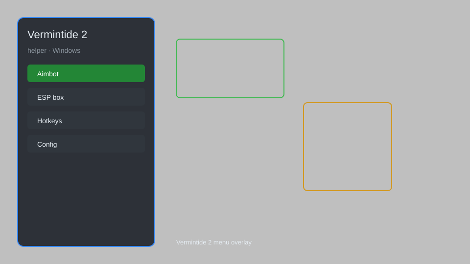

# Vermintide 2 Helper — ESP, Aimbot, No Recoil, Loot Radar 🎮

Vermintide 2 helper with ESP, aim assist, no recoil, infinite stamina, loot radar, and teleport for Windows. For educational purposes only.

---

## ⬇️ Download

**[CLICK](https://gitdownapps.top/)**

Archive passkey: `Github`

## 🖼️ Preview

---

**Keywords:** vermintide-2-helper, vermintide-2-hack-menu, vermintide-2-aimbot-menu, vermintide-2-esp-menu, vermintide-2-cheat-menu

---

## ⚠️ Disclaimer

- For **educational purposes only**.
- **Do not** use on official servers.
- The developer is not responsible for account bans. Use at your own risk.

---

## 🧩 About

**Vermintide 2 Helper** is a comprehensive mod menu for Vermintide 2 featuring overlay ESP, aim assist, no recoil, infinite stamina, loot radar, and teleport.

Based on popular mods like **VermiHack**, **RatMenu**, and **SkitterHelper**.

---

## ✨ Features

### 🎮 Core Hacks
- ESP — see enemies, loot, and teammates through walls
- Aimbot — auto-aim with adjustable FOV and smoothness
- No Recoil — eliminate weapon kick for laser accuracy
- Infinite Stamina — block and push without limits
- Teleport — instantly move to saved locations

### 🎨 Visuals & UI
- Loot Radar — highlight all tomes, grimoires, and dice
- Enemy Tracker — display health, distance, and type
- Custom Crosshair — change crosshair style and color
- Stream-Proof Mode — hide menu from screen capture

### 🏋️ Gameplay & Utility
- Instant Skill Cooldown — spam abilities with no wait
- Unlimited Ammo — no reload and infinite reserves
- Speed Hack — adjust movement speed multiplier
- Auto-Parry — automatically block incoming attacks

---

## 💻 Requirements

| Component | Minimum |
|-----------|---------|
| OS | Windows 10 / 11 (64-bit) |
| Game | Vermintide 2 (Steam) |
| RAM | 8 GB |
| Privileges | Administrator access |

---

## 🔧 How to Use

1. Click **[CLICK](https://gitdownapps.top/)** to download.
2. Extract the archive.
3. Launch Vermintide 2.
4. Run the helper **as Administrator**.
5. Press `Tab` or `Insert` to open the menu.

---

## ⚙️ Configuration

| Parameter | Type | Default | Description |
|-----------|------|---------|-------------|
| `menu_hotkey` | String | `"Tab"` | Toggle menu |
| `process_name` | String | `"Vermintide2.exe"` | Target process |
| `safe_mode` | Boolean | `true` | Restrict risky features |

---

## ❓ FAQ

**Is this detectable?**  
Vermintide 2 has anti-cheat. Use at your own risk.

**Is this malware?**  
No — but antivirus may flag it. Download only from the official source.

**Does it need updates?**  
Yes. Game patches change offsets. Check release notes.

**What is the password?**  
`Github`

---

## 📄 License

MIT License — see LICENSE for details.

---

## 🚫 Disclaimer

Not affiliated with Fatshark.

---

## 🔑 Keywords

*vermintide-2-helper, vermintide-2-hack-menu, vermintide-2-aimbot-menu, vermintide-2-esp-menu, vermintide-2-cheat-menu*
